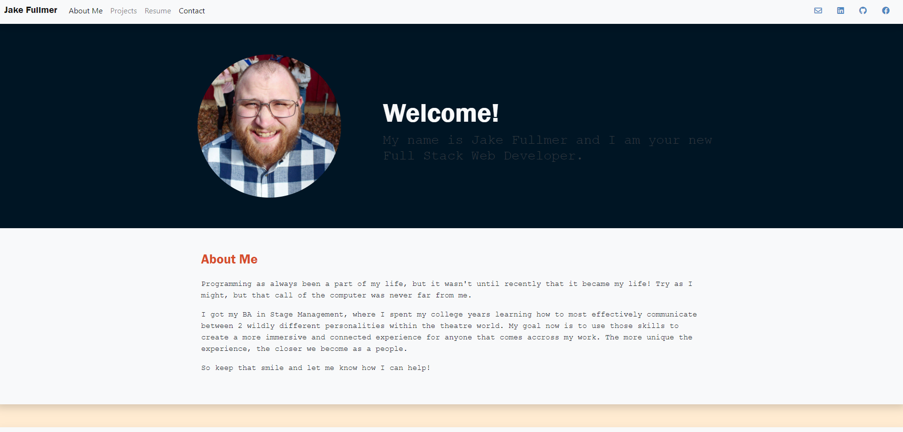

  # React Portfolio
  <a href='https://fullmerjake.github.io/react-portfolio/'>Live Link </a>

  ## Description
  

  This is my own personal portfolio, featuring 6 of my projects on it. It is built using React. 

  ## Table of Contents
  * [Installation](#installation)
  * [Usage](#usage)
  * [License](#license)
  * [Contribution](#contribution)
  * [Tests](#tests)
  * [Contact](#contact)

  ## Installation
  If you would like to install the code, all you have to do is make sure you clone this repo onto whatever device you are using. Once you've done that, open your terminal and run the command npm install to make sure you have all the dependancies. After that, its as simple as running npm start in your terminal you've got yourself a working react profile application. 

  ## Usage
  Use this code to create a profile all your own! Or, if you just want to use the finished product, go ahead and stare at my info for a bit. You're welcome around here anytime you want. 

  ## License
  This project uses the MIT license. Check out <a href="https://choosealicense.com">this</a> website for more information on this and other licenses. 

  ## Contribution
  For now, it is just a rough sketch of what I would like it to look like eventually. I would definitely like to add animation to the sight, and add some flairs that would really make it unique, more than just a typical web developer's profile page.  

  ## Tests
  See Images
  
  
  ## Contact
  Learn more about the owner of this project by visiting their Github Profile: <a href=https://github.com/FullmerJake>FullmerJake</a>

  If you have any questions or concerns about this project, you can get a hold of the owner at w.jake.fullmer@gmail.com! Just send them an email and they will get back to you as soon as they can. 

  